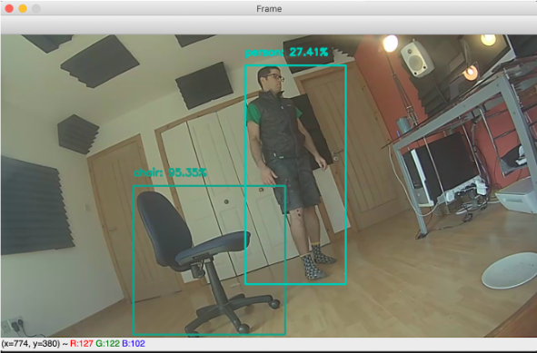
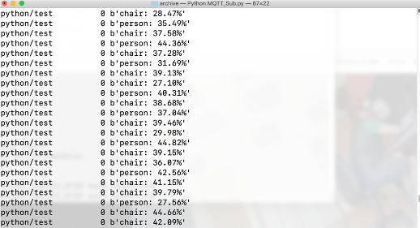

# Overview

This document provides a step by step guide to integrating the RTSP output from a Meraki MV camera, with a pretrained OpenCV 3.3 dnn module, running SSD Detection

The script shall:

* launch a local video stream, with a bounding box for detected objects and associated confidence score
* print to cli the object and confidence score  of detected objects
* publish to an MQTT broker the object and confidence of objects detected, using the topic "python/test"

This was developed and tested using a Macbook Pro. The detection time for objects entering the frame to being reported on the video and MQTT stream is of the order 1.5-2.0 seconds.

# Dependencies

##Python Dependancies
The solution has been tested against the following:

TBD

##Meraki Camera Requirements
Firmware version 4.2 or newer
2nd generation MV camera
For further details:
https://documentation.meraki.com/MV/Advanced_Configuration/External_RTSP
# Steps

## Installation

### Create a Virtual Environment:
    $virtualenv venv

### Activate the virtual Environment:
    $source venv/bin/activate

### Clone the Repo:
    $git clone https://github.com/andersm9/Meraki_OpenCV_RTSP.git
    $cd Meraki_OpenCV_RTSP

### Install the requirements:
    $pip3 install -r requirements.txt

# Dashboard configuration:

Cameras -> <your_camera> -> Setting -> External RTSP -> yes

Make a note of your RTSP stream URL 

# Create a file "credentials.ini" with the following contents:

[camera]

#RTSP source

host = \*\*rtsp:\/\/\<camera IP>/live\*\*
    
#e.g.host = rtsp://192.168.127.29:9000/live

[mqtt]

broker = \*\*mqtt broker location\*\*
    
#e.g broker = broker.hivemq.com

port = \*\*mqtt broker port\*\*
    
#e.g. port = 1883

[ssd]

#set location of SSD model (preconfigured for this repo)

prototxt = MobileNetSSD_deploy.prototxt.txt

model = MobileNetSSD_deploy.caffemodel

#set confidence level for detection

conf = \*\*0-1\*\*

#e.g for 20% confidence or above for detection

#conf = 0.2

## Launch the script:

    $python3 MV_OpenCV.py
## Example Local Video

## Example MQTT stream

